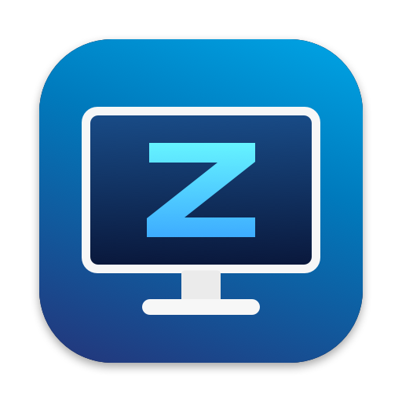
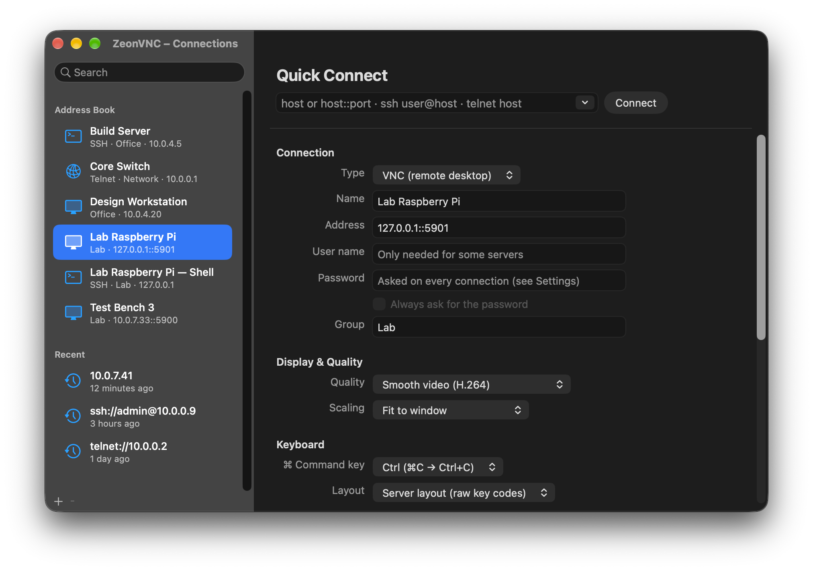
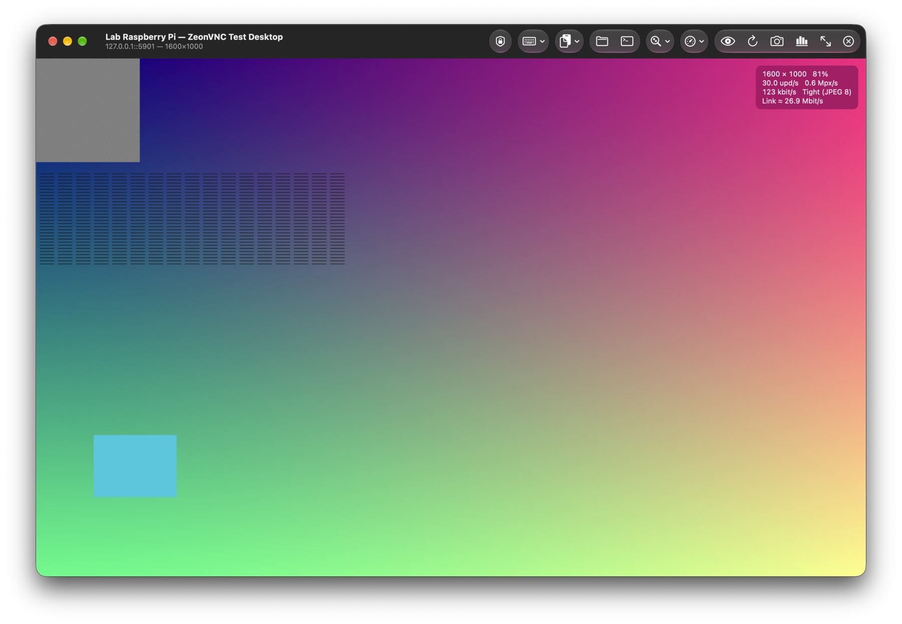
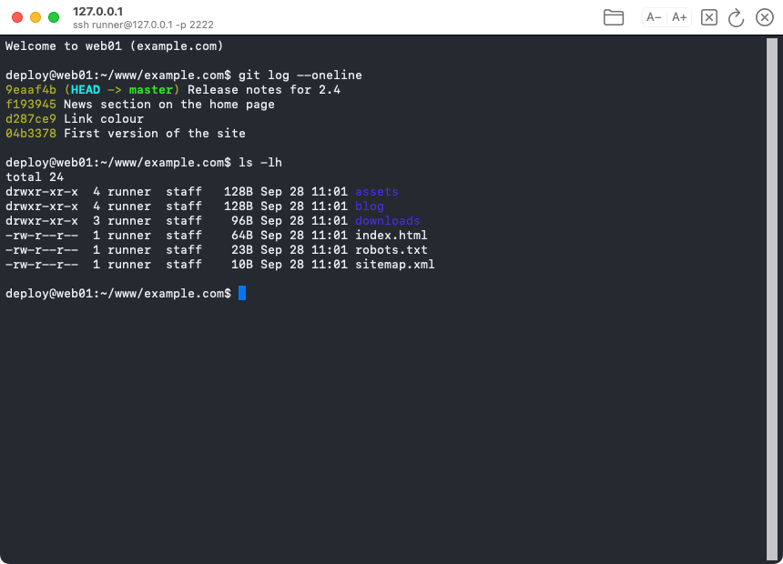
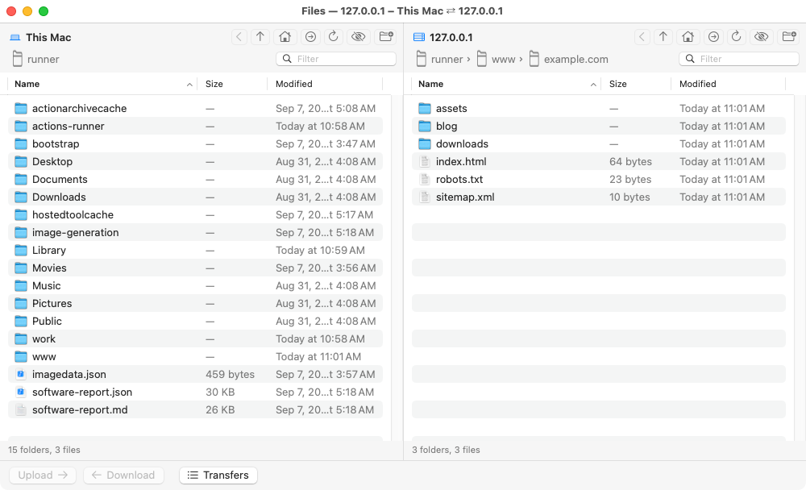

<p align="center">
  
</p>

<h1 align="center">Zeon Remote</h1>

<p align="center">
  A fast, native macOS client for <b>VNC</b>, <b>RDP</b>, <b>SSH</b>, <b>Telnet</b> and
  <b>SFTP</b> — remote desktops, terminals and file transfer in one app.
</p>

<p align="center">
  <a href="https://github.com/selimozbas/zeonremote/releases/latest"><b>Download</b></a> ·
  <a href="docs/USER_GUIDE.md">User guide</a> ·
  <a href="docs/BUILDING.md">Building</a>
</p>

---

Zeon Remote is built for macOS with AppKit and Metal. It connects to standard VNC
servers (UltraVNC, TightVNC, RealVNC with VNC password authentication, WayVNC on the
Raspberry Pi, x11vnc and others) and to Windows over RDP, opens SSH and Telnet
terminals, and moves files over SFTP and FTP in a two pane window — handy for labs
and offices full of test devices.

Zeon Remote was called **ZeonVNC** up to version 0.3.3. Saved connections, passwords
and settings carry over; after installing Zeon Remote you can delete `ZeonVNC.app`.

<p align="center">
  
</p>

## Features

### Remote desktop (VNC)
- Metal rendering straight from an IOSurface framebuffer (no copies), sRGB colour,
  mipmapped downscaling so text stays readable
- Scaling: fit to window, 100 %, pixel perfect (1:1 on Retina), stretch, zoom and
  pinch to zoom, edge panning for large screens
- Encodings: Tight (JPEG), ZRLE, Hextile, Raw, CopyRect and **H.264 with hardware
  decoding** (VideoToolbox — e.g. from the Raspberry Pi's hardware encoder)
- Quality profiles (automatic, lossless, high, balanced, low bandwidth, smooth video)
  or custom encoding / JPEG quality / compression / colour depth
- Security: VNC password, Plain, VeNCrypt TLS / X509, RSA-AES (RA2), DH, MSLogonII;
  an "encrypted connections only" mode
- Automatic reconnect, reverse ("listening") connections on port 5500, resizing the
  remote screen to the window
- Keyboard: every key goes to the remote side, including ⌘ shortcuts; ⌘ can act as
  Ctrl, Windows key or Alt; server or Mac keyboard layout; local shortcuts use ⌃⌥⌘
- Special keys (Ctrl-Alt-Del, Ctrl-Shift-Esc, Windows key, Win-L/R/E/D, Alt-Tab,
  Alt-F4, Print Screen), typing the clipboard as keystrokes
- Two-way clipboard, screenshots, live statistics, native tabs and full screen

<p align="center">
  
</p>

### Remote desktop (RDP)
- Windows Remote Desktop (and xrdp, GNOME Remote Desktop) with FreeRDP: network
  level authentication (NLA), TLS, the modern graphics pipeline
- The Windows desktop follows the window size, at the Mac's pixel density
- Keyboard, mouse, wheel, two-way clipboard (text), the same special keys and
  scaling modes as VNC sessions
- Certificates are trusted per device, like VNC and SSH keys

### SSH and Telnet terminals
- xterm-256color terminal: vim, htop, tmux, nano, colours and mouse work
- SSH login with ssh-agent, keys from `~/.ssh` or a password; Telnet with terminal
  type and window size negotiation
- One click from a VNC session to an SSH terminal or the file transfer window of the
  same device

<p align="center">
  
</p>

### File transfer (SFTP)
- Two panes: this Mac on the left, the remote device on the right; drag and drop in
  both directions, Upload / Download buttons, double click to copy across
- Asks what to do when a file already exists — **Replace, Keep Both, Skip or Stop** —
  optionally for all remaining files; folders are merged
- Files dropped on the remote screen of a VNC session are uploaded to the remote desktop

<p align="center">
  
</p>

### Connections and credentials
- Address book with search, groups, recent connections, JSON import / export and
  import of `.vnc` connection files; `vnc://` URLs
- Quick connect understands `host`, `host::port`, `ssh user@host -p 2222`,
  `ssh://user@host`, `telnet host 23`
- Passwords are stored in the macOS Keychain — or not at all: with saving turned off
  in Settings you are asked every time
- **Per-device trust for DHCP networks**: passwords, TLS certificates and SSH host
  keys belong to the device (its MAC address on the local network, otherwise its
  key), not to the IP address. When another device gets the same address, the saved
  password is not sent and you are told what changed. See
  [docs/SECURITY.md](docs/SECURITY.md).

## Install

Download `ZeonRemote-0.3.3.dmg` from the
[releases page](https://github.com/selimozbas/zeonremote/releases/latest), open it and
drag Zeon Remote to Applications.

**Requirements:** a Mac with Apple silicon, macOS 15 Sequoia or later.

The release is not notarized by Apple yet, so macOS says *"Apple could not verify
"Zeon Remote" is free of malware"* on the first start. Click **Done** (not Move to Trash),
then open **System Settings → Privacy & Security**, scroll down to *"Zeon Remote" was
blocked…*, click **Open Anyway** and confirm with your password. (Right click → Open
no longer works on macOS 15 and later.)

Or run once in Terminal:

```bash
xattr -dr com.apple.quarantine "/Applications/Zeon Remote.app"
```

When you first connect to a device on your local network, macOS asks whether
Zeon Remote may access the local network — allow it.

## Documentation

| | |
|---|---|
| [User guide](docs/USER_GUIDE.md) | Connecting, keyboard, scaling, terminals, file transfer, shortcuts |
| [Security and credentials](docs/SECURITY.md) | How passwords and keys are stored and trusted |
| [Building from source](docs/BUILDING.md) | Dependencies, build, signing, DMG |
| [Architecture](docs/ARCHITECTURE.md) | How the code is organised |
| [Changelog](CHANGELOG.md) | Release history |

## Contributing

Bug reports and pull requests are welcome. Please describe the server (product and
version) for connection problems; the log is printed when Zeon Remote is started from a
terminal: `"/Applications/Zeon Remote.app/Contents/MacOS/ZeonRemote"`.

## License

Zeon Remote is free software under the **GNU General Public License, version 2 or (at
your option) any later version** — see [LICENSE](LICENSE). Binary releases bundle
further libraries and are distributed under GPL-3.0-or-later; see
[THIRD_PARTY_NOTICES.md](THIRD_PARTY_NOTICES.md).
